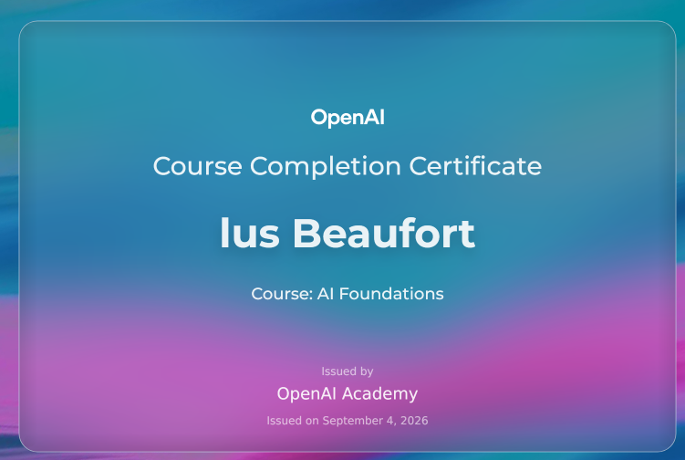
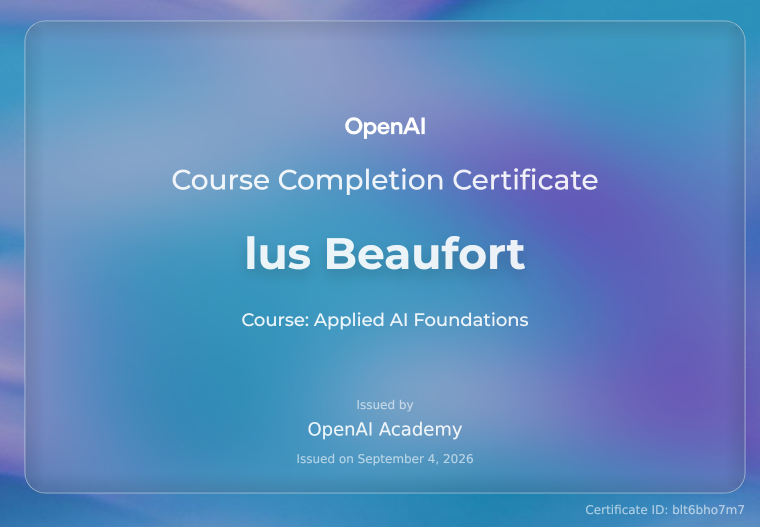
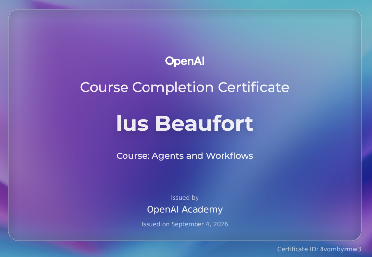

# OpenAI Academy 课程完成证书

本仓库用于存档 [LUO] 在 [OpenAI Academy](https://academy.openai.com/home/courses/applied-ai-foundations-hgk7r) 完成的 **Applied AI Foundations** 课程学习路径中获取的三张课程完成证书（Course Completion Certificate）。

- **持有人**：l\*\*\* B\*\*\*（GitHub：[@LuoCoderme](https://github.com/LuoCoderme)）
- **签发机构**：OpenAI Academy
- **签发日期**：2026 年 9 月 4 日

***

## 证书总览

| # | 课程名称                   | 证书编号         | 签发日期       | 证书文件                                     |
| - | ---------------------- | ------------ | ---------- | ---------------------------------------- |
| 1 | AI Foundations         | `3guy****` | 2026-09-04 | `certificate-ai-foundations.png`         |
| 2 | Applied AI Foundations | `blt6****` | 2026-09-04 | `certificate-applied-ai-foundations.png` |
| 3 | Agents and Workflows   | `8vqm****` | 2026-09-04 | `certificate-agents-and-workflows.png`   |

***

## 证书详情

### 1. AI Foundations

- **课程**：AI Foundations（AI 基础）
- **类型**：Course Completion Certificate（课程完成证书）
- **证书编号**：`3guy****`（已脱敏）
- **签发方**：OpenAI Academy
- **签发日期**：September 4, 2026

### 2. Applied AI Foundations

- **课程**：Applied AI Foundations（应用 AI 基础，约 80 分钟，Intermediate 级别）
- **类型**：Course Completion Certificate（课程完成证书）
- **证书编号**：`blt6****`（已脱敏）
- **签发方**：OpenAI Academy
- **签发日期**：September 4, 2026

### 3. Agents and Workflows

- **课程**：Agents and Workflows（智能体与工作流）
- **类型**：Course Completion Certificate（课程完成证书）
- **证书编号**：`8vqm****`（已脱敏）
- **签发方**：OpenAI Academy
- **签发日期**：September 4, 2026

***

